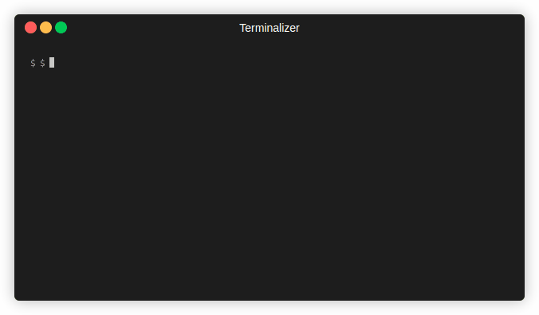

# writenow
An edit-free writing experiment for command-line, written in bash 



## Idea
The original idea comes from [Ensō](https://enso.sonnet.io/):
  > Write now, edit later.

You'll probably write anything without modifing them and when you finished you can edit the result

## Usage
Clone and cd into the repository:
```bash
git clone https://github.com/snosratiershad/writenow.git && cd writenow
```
Execute writenow:
```bash
./writenow
```
Write anything you want and when you're done, press Ctrl+c and type file address you want to write into it.
If you don't want to write into any file, press Ctrl+c again for exit.
